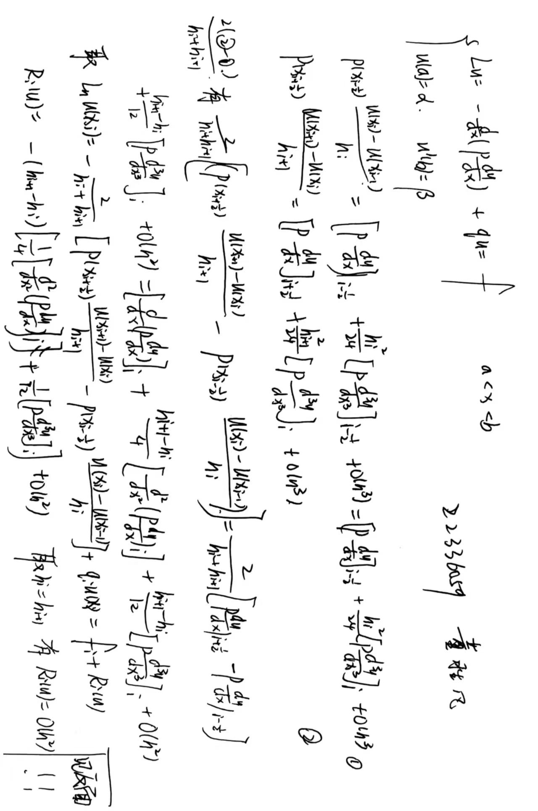

# Finite-Difference-Methods

## 效果展示
**（1）绘制数值解$u_h$和精确解$u$的函数图像**

**（2）绘制误差函数$u_h - u$的函数图像**

**（3）jacobi迭代法不收敛的原因**

以步长h = 0.2为例，求出迭代矩阵的特征值，可以发现jacobi迭代法不收敛

## 算法原理

**（1）差分方程组**
利用有限差分方程求解非齐次两点边值问题，使用泰勒公式构造差分方程对微分形式进行逼近，最终得到三对角矩阵A和向量b，求解方程 $Ax = b$ 即可得到待求解函数u在各个剖分点上的近似函数值。求解方程使用高斯消元法和jacobi迭代法



<font color=blue>**注意：**
左右边值的影响相对于整个差分方程组来说很小，然而由于右边值为非齐次，无法直接代入差分方程，因此我们使用积分来消除右边值导数形式，然后使用中矩形求积公式和梯形求积公式进行近似即可。
（见$W(x_{n-\frac{1}{2}})$和$\int_{x_{n-\frac{1}{2}}}^{x_n} f(x)\,dx$的近似）

</font>
上边是一个通用的差分方程组，下面针对本次实验，对于

$$
[a,b]=[-1,1],p(x)=-(π^2-1)-1,q(x)=1,\alpha=0,\beta =\pi e 
$$

的情形，推导出一个具体的差分方程组的表达形式，推导过程如下，只要将上述函数值代入即可。


**（2）高斯消元法**

<font color=blue>根据数值分析的理论，如果除数是一个很小的数，那么会带来很大的舍入误差，因此这里我对高斯消元法进行改进，使用按列选主元的高斯消元法。
具体来说，就是在进行高斯消元之前，先对系数矩阵A的指定列每一行进行扫描，选择绝对值最大的元素作为本轮迭代的主元，这样就能有效避免除数是很小的数这种情况，求解更加准确。</font>


**（3）雅可比迭代法**
对待求解方程 $ Ax=b $ 分解如下，$A=D-L-U$，其中
$$D = 
\begin{pmatrix}
a_{11} & {} & {} & {} \\
{} & a_{22} & {} & {} \\
{} & {} & \ddots & {} \\
{} & {} & {} & a_{nn}
\end{pmatrix}
$$
$$
L = 
\begin{pmatrix}
0 & {} & {} & {} \\
-a_{21} & 0 & {} & {} \\
\vdots & \vdots & \ddots & {} \\
-a_{n1} & -a_{n2} & \dots & 0
\end{pmatrix}
$$
$$
U = 
\begin{pmatrix}
0 & -a_{12} & \dots & -a_{1n} \\
{} & 0 & \dots & -a_{2n} \\
{} & {} & \ddots & \vdots \\
{} & {} & {} & 0
\end{pmatrix}
$$
于是，$Dx = (L+U)x+b$，写成迭代形式，有$x^{(k+1)} = D^{-1}(L+U)x^{(k)}+b$，易知，jacobi迭代法收敛当且仅当矩阵$D^{-1}(L+U)$的谱半径小于1

**（4）对雅可比迭代法不收敛的分析**
根据（3）中的分析，只需计算迭代矩阵的谱半径，调用np库中的函数即可。
```python
def analysis_for_jacobi(h: np.float64=0.20):
    A, _, _ = build_system(h)
    J = np.zeros_like(A)
    for i in range(A.shape[0]):
        for j in range(A.shape[1]):
            if i == j:
                J[i, j] = 1 / A[i, j]
            else:
                J[i, j] = -A[i, j]
    eigenvalues, _ = np.linalg.eigh(J)
    print(eigenvalues)
    a = np.max(np.abs(eigenvalues))
    if a < 1:
        print("Jacobi method is convergent.")
    else:
        print("Jacobi method is divergent.")
```

